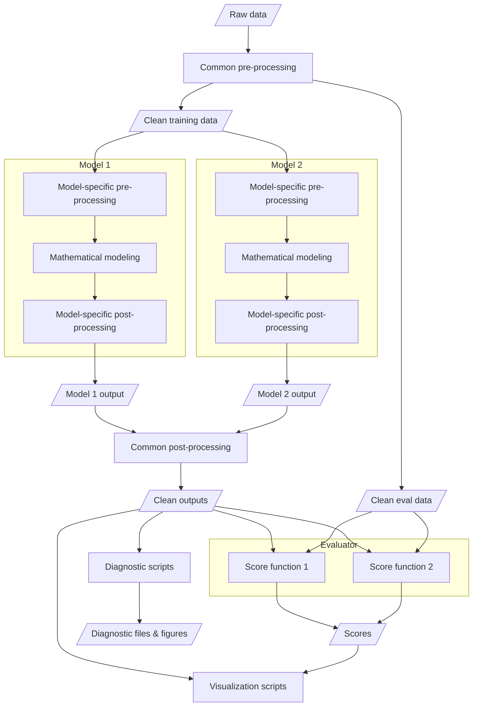

# Architecture

- Raw data comes in whatever form
- They get cleaned up to some common schema
- A "model" is everything between the common-schema input and some common-schema output
- There might be further post-processing beyond that, that is still upstream of visualizations and so forth
- An "evaluator" is some thing that coordinates the action of multiple score functions

